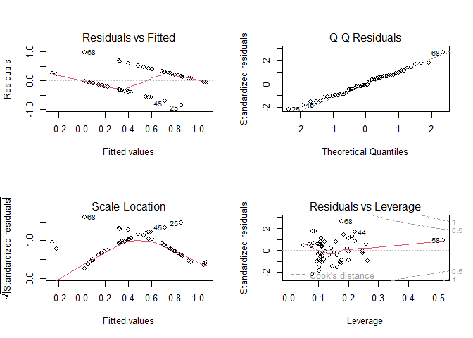

# Instructions! Read this first.

The exam is open note, open course website, open class-related code
repositories (mine and those you produced in class) - you can even look
for help with R-specific issues! However, you may not get external help
(from other students, directed internet searches re, etc.) regarding the
data. Please update the statement below to acknowledge these
instructions (and that you can use git).

I, INSERT YOUR NAME HERE, promise to not seek external help on the exam.
I understand any academic issues will result in a D or F on the exam or
in the class and be reported to the Dean of Students.

Good luck!

# Snakes

Understanding how environmental factors impact species can be important
to conservation and management (and relates directly to exploring how
factors impact outcomes - analysis!). A colleague is focused on how
various factors impact snake behavior, habitat use, and species
interactions for a species that lives in semi-arid deserts that are
occasionally impacted by heavy (monsoon) rains. They've collected a lot
of data but aren't sure how to analyze it.

## 1

Analyze the data from 78001 final question #1. As a reminder (note
dataset and code they provided are here!)

> For one study, the researcher used visual surveys (eg, walking through
> the area) to count snakes in a local reserve. For each survey, they
> documented
>
> -   were snakes observed (column in dataset: pres , 1=yes, 0= no)
>
> -   season (column in dataset: season, pre-monsoon, monsoon,
>     post-monsoon)
>
> -   ambient temperature (column in dataset: TA,°C)
>
> -   relative humidity (column in dataset: RH)
>
> -   barometric pressure (column in dataset: BP, millibars)
>
> -   wind speed(column in dataset: wind , m/s)
>
> -   stream flow (column in dataset: streamflow..m3., max stream flow
>     (m3/s) during survey window)
>
> They tried to use a linear model to determine which factors were
> important to determing snake presence. They haven't had stats in a
> while, but they found some code online. They started by building a
> model with all factors, checking the p-values, and checking their
> assumptions. However, this led to some issues.
>
> -   season had 3 levels - only 2 are listed
>
>     
>     ```r
>     snakes <- read.csv ("https://docs.google.com/spreadsheets/d/e/2PACX-1vR1L-2LEdYMV-HNo3b6aexfT2DyNfC7PhujoNQ33Y6gIBFIPrrWtvdKIUz146or6q43QI05gv0KR9Fa/pub?gid=1499758404&single=true&output=csv", 
>                         stringsAsFactors = T, na.strings = c("NA", "#DIV/0!"))
>     ```
>
>     
>     ```r
>     snake_presence_lm <- lm(pres ~ season+TA+RH+BP+wind+streamflow..m3.,
>                           data= na.omit(snakes))
>     summary(snake_presence_lm)
>     ```
>     
>     ```
>     ## 
>     ## Call:
>     ## lm(formula = pres ~ season + TA + RH + BP + wind + streamflow..m3., 
>     ##     data = na.omit(snakes))
>     ## 
>     ## Residuals:
>     ##      Min       1Q   Median       3Q      Max 
>     ## -0.84907 -0.31961 -0.04701  0.25022  0.97757 
>     ## 
>     ## Coefficients:
>     ##                     Estimate Std. Error t value Pr(>|t|)   
>     ## (Intercept)         7.143784  21.106794   0.338  0.73659   
>     ## seasonpost-monsoon -0.096723   0.203171  -0.476  0.63633   
>     ## seasonpre-monsoon  -0.241782   0.190639  -1.268  0.21122   
>     ## TA                  0.043839   0.018068   2.426  0.01932 * 
>     ## RH                  0.006350   0.007491   0.848  0.40110   
>     ## BP                 -0.008841   0.022787  -0.388  0.69985   
>     ## wind                0.372887   0.201412   1.851  0.07069 . 
>     ## streamflow..m3.    -0.505459   0.159690  -3.165  0.00278 **
>     ## ---
>     ## Signif. codes:  0 '***' 0.001 '**' 0.01 '*' 0.05 '.' 0.1 ' ' 1
>     ## 
>     ## Residual standard error: 0.4118 on 45 degrees of freedom
>     ## Multiple R-squared:  0.4239,	Adjusted R-squared:  0.3342 
>     ## F-statistic: 4.729 on 7 and 45 DF,  p-value: 0.000482
>     ```
>
> -   Some of these plots looked odd (note the na.omit(snakes) portion
>     is just removing all rows with an NA - use it as needed)
>
>     
>     ```r
>     par(mfrow=c(2,2))
>     plot(snake_presence_lm)
>     ```
>     
>     <!-- -->
>
>     How would you recommend they analyze the data. Make sure you
>     justify your approach and explain any needed steps; also list
>     hypotheses if needed. (7 points)

Analyze the data. Make sure you justify your approach and explain any
needed steps; also list hypotheses if needed.  (7 points)

## 2

Analyze the data from 78001 final question #2. As a reminder (note
dataset and table they provided are here!)

> For the survey, they also noted they weren't sure how to specify
> season. Although they originally specified it as a factor with 3
> levels based on date (pre-monsoon, monsoon, post-monsoon),they could
> also just specify it as wet or dry. They know the 2 measures are
> related based on the following table:
>
> 
> ```r
> seasons <- read.csv("https://docs.google.com/spreadsheets/d/e/2PACX-1vR1L-2LEdYMV-HNo3b6aexfT2DyNfC7PhujoNQ33Y6gIBFIPrrWtvdKIUz146or6q43QI05gv0KR9Fa/pub?gid=1603572731&single=true&output=csv",
>                     stringsAsFactors = T, na.strings = c("NA", "#DIV/0!"))
> ```
>
> 
> ```r
> table(seasons$season.2, seasons$season)
> ```
> 
> ```
> ##      
> ##       monsoon post-monsoon pre-monsoon
> ##   dry       0           22          14
> ##   wet      35            0           0
> ```
>
> Are there any issues with including both variables (labeled season and
> season.2 in the dataset) in the model? If so, how would you choose
> which one (if either) to include?  (7 points)

Demonstrate how you would choose which variable(s) to include. Make sure
you justify your approach and explain any needed steps; also list
hypotheses if needed.  (7 points)

## 3

Analyze the data from 78001 final question #3. As a reminder (note
dataset and code they provided are here!)

> As part of their surveys, they also collected morphometric data
> including
>
> -   snout-vent length (SVL..mm., mm)
> -   mass (mass..g., g)
> -   age (age, factor labelled as neonate, immature, or adult)
>
> A common measure of body condition in their field is log(Mass)/log(snout-vent length)
> (also in the dataframe as logM.logSVL). They are curious if this
> condition index (focus on this for now) differs among age.\
> How would you recommend they analyze the data? Make sure you justify
> your approach and explain any needed steps; also list hypotheses if
> needed.

Analyze the data. Make sure you justify your approach and explain any
needed steps; also list hypotheses if needed.  (7 points). Data is
avialable using


```r
size <- read.csv("https://docs.google.com/spreadsheets/d/e/2PACX-1vR1L-2LEdYMV-HNo3b6aexfT2DyNfC7PhujoNQ33Y6gIBFIPrrWtvdKIUz146or6q43QI05gv0KR9Fa/pub?gid=276877765&single=true&output=csv",
                 stringsAsFactors = T)
```

## 4

Plot the data on condition index and age (from question 3). (7 points)

## 5

Analyze the data from 78001 final question #5. As a reminder (note
dataset and code they provided are here!)

> Given that age classes may respond differently to stressors, the
> researcher also wanted to know if snake movement (defined as
> 0=observed snake not moving; 1=observed snake moving) differed among
> age classes. They share this table:
>
> 
>
> 
> ```r
> behavior_table
> ```
> 
> ```
> ##    
> ##     adult juvenile
> ##   0    29       29
> ##   1    14       16
> ```
>
> Do you have any advice to offer on how they may want to analyze the
> data? Make sure you justify your approach and explain any needed
> steps; also list hypotheses if needed. (7 points)

Analyze the data. Make sure you justify your approach and explain any
needed steps; also list hypotheses if needed.  (7 points). Data and
table are available using


```r
behavior <- read.csv("https://docs.google.com/spreadsheets/d/e/2PACX-1vR1L-2LEdYMV-HNo3b6aexfT2DyNfC7PhujoNQ33Y6gIBFIPrrWtvdKIUz146or6q43QI05gv0KR9Fa/pub?gid=1276145787&single=true&output=csv",
                     stringsAsFactors = T)
behavior_table <- table(behavior$movement, behavior$ageclass)
```

## 6

Analyze the data from 78001 final question #6. As a reminder (note
dataset and code they provided are here!)

> In a fun/odd twist, they were also curious about how snakes interacted
> with their predators. Although many other snakes in use camouflage
> (brown or black color), this snake has several colorful versions (red
> and yellow) The researchers built snake models in these colors out of
> play dough, plus an orange morph, to determine how the bright color
> impacts predation rates (measured as bird strikes on the models). They
> put 50 models of each color in 4 different areas and checked the
> models for bird strikes after 48 hours. All models were collected.
>
> Data includes
>
> -   Model (representing color of model: Bl(ack), Br(own), N(orange,
>     novel color), R(ed), Y(ellow))
> -   Avian.Attack (evidence of bird attack? 0=no, 1 = yes)
> -   Transect (location of model)
>
> Do you have any advice to offer on how they may want to analyze the
> data? Make sure you justify your approach and explain any needed
> steps; also list hypotheses if needed. (7 pts)

Analyze the data. Make sure you justify your approach and explain any
needed steps; also list hypotheses if needed.  (7 points)

Data is available using:


```r
color <- read.csv("https://docs.google.com/spreadsheets/d/e/2PACX-1vQHWuORlDpmKhPsHDWSsGrwlzK66EqP2-GGIikhljBgsRF0nNsqbcFV5_c6JdN6sBAF55-XX4oAZJlc/pub?gid=187879458&single=true&output=csv", stringsAsFactors = T)
```
