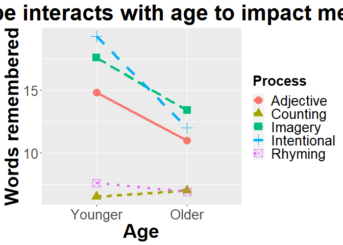
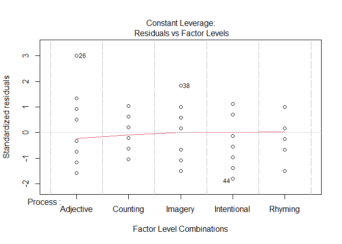

Before doing this, review the **8. 2-way Anova** lecture set slides from 
https://sites.google.com/view/biostats/lessons/2-way-anovas-and-interactions and
the **8_Blocking_and_interactions.R** script in the lecture files folder of the
[CUNY-BioStats github repository](https://github.com/jsgosnell/CUNY-BioStats).
Make sure you are comfortable with null and alternative hypotheses and appropriate plots
for all examples.


Remember you should

* add code chunks by clicking the *Insert Chunk* button on the toolbar or by
pressing *Ctrl+Alt+I* to answer the questions!
* **knit** your file to produce a markdown version that you can see!
* save your work often 
  * **commit** it via git!
  * **push** updates to github
  
## Examples

### If interaction is significant

Following the memory example from class, read in and check data


```r
memory <- read.table("http://www.statsci.org/data/general/eysenck.txt", header = T,
                     stringsAsFactors = T)
str(memory)
```

```
## 'data.frame':	100 obs. of  3 variables:
##  $ Age    : Factor w/ 2 levels "Older","Younger": 2 2 2 2 2 2 2 2 2 2 ...
##  $ Process: Factor w/ 5 levels "Adjective","Counting",..: 2 2 2 2 2 2 2 2 2 2 ...
##  $ Words  : num  8 6 4 6 7 6 5 7 9 7 ...
```

Let's put younger level first


```r
library(plyr)
memory$Age <- relevel(memory$Age, "Younger")
```

and graph


```r
library(Rmisc)
```

```
## Loading required package: lattice
```

```r
function_output <- summarySE(memory, measurevar="Words", groupvars =
                               c("Age", "Process"), na.rm = T)
library(ggplot2)
ggplot(function_output, aes(x=Age, y=Words,color=Process, 
                                   shape = Process)) +
  geom_line(aes(group=Process, linetype = Process), size=2) +
    geom_point(size = 5) +
  ylab("Words remembered")+ 
  xlab("Age") + 
  ggtitle("Process type interacts with age to impact memory")+
  theme(axis.title.x = element_text(face="bold", size=28), 
        axis.title.y = element_text(face="bold", size=28), 
        axis.text.y  = element_text(size=20),
        axis.text.x  = element_text(size=20), 
        legend.text =element_text(size=20),
        legend.title = element_text(size=20, face="bold"),
        plot.title = element_text(hjust = 0.5, face="bold", size=32))
```

<!-- -->

There appears to be some interactions. Let' build a model


```r
memory_interactions <- lm(Words ~ Age * Process, memory)
```

and check assumptions.


```r
par(mfrow=c(2,2))
plot(memory_interactions)
```

<!-- -->

These appear to be met, so look at output


```r
library(car)
```

```
## Loading required package: carData
```

```r
Anova(memory_interactions, type = "III")
```

```
## Anova Table (Type III tests)
## 
## Response: Words
##             Sum Sq Df  F value    Pr(>F)    
## (Intercept) 2190.4  1 272.9281 < 2.2e-16 ***
## Age           72.2  1   8.9963 0.0034984 ** 
## Process     1353.7  4  42.1690 < 2.2e-16 ***
## Age:Process  190.3  4   5.9279 0.0002793 ***
## Residuals    722.3 90                       
## ---
## Signif. codes:  0 '***' 0.001 '**' 0.01 '*' 0.05 '.' 0.1 ' ' 1
```

Since interaction is significant, analyze subsets. For example, 


```r
memory_interactions_young <- lm(Words ~ Process, memory[memory$Age == "Younger",])
plot(memory_interactions_young)
```

<!-- --><!-- --><!-- --><!-- -->

```r
Anova(memory_interactions_young, type = "III")
```

```
## Anova Table (Type III tests)
## 
## Response: Words
##             Sum Sq Df F value    Pr(>F)    
## (Intercept) 2190.4  1 343.442 < 2.2e-16 ***
## Process     1353.7  4  53.064 < 2.2e-16 ***
## Residuals    287.0 45                      
## ---
## Signif. codes:  0 '***' 0.001 '**' 0.01 '*' 0.05 '.' 0.1 ' ' 1
```

There is a significant difference in words recalled based on process, but why? 
Investigate with post-hoc tests.


```r
library(multcomp)
```

```
## Loading required package: mvtnorm
```

```
## Loading required package: survival
```

```
## Loading required package: TH.data
```

```
## Loading required package: MASS
```

```
## 
## Attaching package: 'TH.data'
```

```
## The following object is masked from 'package:MASS':
## 
##     geyser
```

```r
comp_young <- glht(memory_interactions_young, linfct = mcp(Process = "Tukey"))
summary(comp_young)
```

```
## 
## 	 Simultaneous Tests for General Linear Hypotheses
## 
## Multiple Comparisons of Means: Tukey Contrasts
## 
## 
## Fit: lm(formula = Words ~ Process, data = memory[memory$Age == "Younger", 
##     ])
## 
## Linear Hypotheses:
##                              Estimate Std. Error t value Pr(>|t|)    
## Counting - Adjective == 0      -8.300      1.129  -7.349  < 1e-04 ***
## Imagery - Adjective == 0        2.800      1.129   2.479  0.11362    
## Intentional - Adjective == 0    4.500      1.129   3.984  0.00217 ** 
## Rhyming - Adjective == 0       -7.200      1.129  -6.375  < 1e-04 ***
## Imagery - Counting == 0        11.100      1.129   9.828  < 1e-04 ***
## Intentional - Counting == 0    12.800      1.129  11.333  < 1e-04 ***
## Rhyming - Counting == 0         1.100      1.129   0.974  0.86545    
## Intentional - Imagery == 0      1.700      1.129   1.505  0.56459    
## Rhyming - Imagery == 0        -10.000      1.129  -8.854  < 1e-04 ***
## Rhyming - Intentional == 0    -11.700      1.129 -10.359  < 1e-04 ***
## ---
## Signif. codes:  0 '***' 0.001 '**' 0.01 '*' 0.05 '.' 0.1 ' ' 1
## (Adjusted p values reported -- single-step method)
```

### Blocking example


## Practice

### 1

1. A survey was conducted to see if athletes and non-athletes deal with anger in
the same way.  Data is @

angry <- read.csv("https://docs.google.com/spreadsheets/d/e/2PACX-1vSaawG37o1ZUEs1B4keIJpZAY2c5tuljf29dWnzqQ0tHNCzfbz85AlWobYzBQ3nPPXJBLP-FWe4BNZB/pub?gid=1784556512&single=true&output=csv", stringsAsFactors = T)

and more information is at 

http://onlinestatbook.com/case_studies/angry_moods.html.

Focus on the following variables:

Sports
1 = athletes, 2 = non-athletes
Gender
1 = males, 2 = females
Expression (AE)
index of general anger expression: 
(Anger-Out) + (Anger-In) - (Control-Out) - (Control-In) + 48

Is there any evidence that gender or athlete status impact how anger is expressed?

### 2

2. A professor carried out a long-term study to see how various factors impacted
pulse rate before and after exercise.  Data can be found at 
http://www.statsci.org/data/oz/ms212.txt
With more info at 
http://www.statsci.org/data/oz/ms212.html.
Is there evidence that frequency of exercise
(Exercise column) and gender impact change in pulse rate for students who ran 
(Ran column = 1)?

### 3

3. (Continuing from question 2) I’m curious if the treatment (running vs not) even had an impact, and if so did it depend on gender. How would you test this?  

