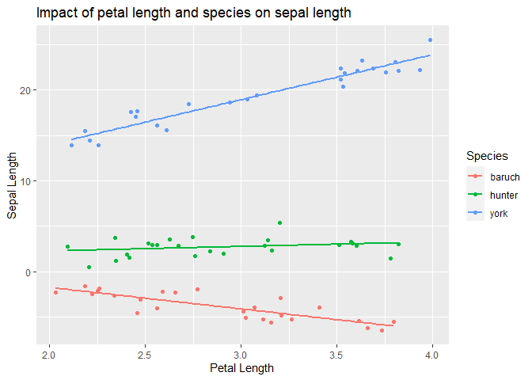

Before doing this, review the ** Combining Multiple Explanatory Variables in Linear Models** lecture set slides from 
https://sites.google.com/view/biostats/lessons/ancova-and-multiple-regression and
the  **10_ANCOVA_and_Regression.R**
script in the lecture files folder of the
[CUNY-BioStats github repository](https://github.com/jsgosnell/CUNY-BioStats). 
Make sure you are comfortable with null and alternative hypotheses and appropriate plots
for all examples.

Remember you should

* add code chunks by clicking the *Insert Chunk* button on the toolbar or by
pressing *Ctrl+Alt+I* to answer the questions!
* **knit** your file to produce a markdown version that you can see!
* save your work often 
  * **commit** it via git!
  * **push** updates to github
  
## Example

Following the iris example from class


```r
set.seed(3)
iris_example_species <-data.frame(
  Species = c(rep("baruch",25), rep("hunter", 25), rep("york", 25)),
  Petal_Length = runif(75,2,4 ))
set.seed(31)
iris_example_species$Sepal_interaction <- 
  iris_example_species$Petal_Length * c(rep(-2, 25),rep(0,25), rep(5,25)) + 
  c(rep(2,25), rep(3,25), rep(4,25)) + rnorm(75)
```

Plot the data


```r
library(ggplot2)
ggplot(iris_example_species, aes(x= Petal_Length, y = Sepal_interaction, color = Species)) +
  geom_point()+
  ylab("Sepal Length") +
  xlab("Petal Length") +
  ggtitle("Impact of petal length and species on sepal length") +
    geom_smooth(method = "lm", se = F)
```

```
## `geom_smooth()` using formula = 'y ~ x'
```

<!-- -->

Analysis would indicate (assumption plots not shown here to allow focus
on interpreting interactions)


```r
library(car)
```

```
## Warning: package 'car' was built under R version 4.3.1
```

```
## Loading required package: carData
```

```r
Anova(lm( Sepal_interaction~ Petal_Length * Species, iris_example_species), 
      type = "III")
```

```
## Anova Table (Type III tests)
## 
## Response: Sepal_interaction
##                       Sum Sq Df  F value    Pr(>F)    
## (Intercept)            7.076  1   8.0267  0.006038 ** 
## Petal_Length          38.452  1  43.6177  6.88e-09 ***
## Species                3.353  2   1.9015  0.157092    
## Petal_Length:Species 227.334  2 128.9368 < 2.2e-16 ***
## Residuals             60.828 69                       
## ---
## Signif. codes:  0 '***' 0.001 '**' 0.01 '*' 0.05 '.' 0.1 ' ' 1
```

interactions do exist. This means we can't interpret the "general"
relationship, so we need to look for each species using regression.


```r
summary(lm(Sepal_interaction ~ Petal_Length, 
         iris_example_species[iris_example_species$Species == "baruch",]))
```

```
## 
## Call:
## lm(formula = Sepal_interaction ~ Petal_Length, data = iris_example_species[iris_example_species$Species == 
##     "baruch", ])
## 
## Residuals:
##     Min      1Q  Median      3Q     Max 
## -1.7194 -0.5504 -0.1860  0.4736  1.7067 
## 
## Coefficients:
##              Estimate Std. Error t value Pr(>|t|)    
## (Intercept)    2.9734     0.9767   3.044  0.00576 ** 
## Petal_Length  -2.3663     0.3335  -7.097 3.14e-07 ***
## ---
## Signif. codes:  0 '***' 0.001 '**' 0.01 '*' 0.05 '.' 0.1 ' ' 1
## 
## Residual standard error: 0.8738 on 23 degrees of freedom
## Multiple R-squared:  0.6865,	Adjusted R-squared:  0.6728 
## F-statistic: 50.36 on 1 and 23 DF,  p-value: 3.144e-07
```

```r
Anova(lm(Sepal_interaction ~ Petal_Length, 
         iris_example_species[iris_example_species$Species == "baruch",]), 
      type="III")
```

```
## Anova Table (Type III tests)
## 
## Response: Sepal_interaction
##              Sum Sq Df F value    Pr(>F)    
## (Intercept)   7.076  1  9.2676  0.005758 ** 
## Petal_Length 38.452  1 50.3604 3.144e-07 ***
## Residuals    17.561 23                      
## ---
## Signif. codes:  0 '***' 0.001 '**' 0.01 '*' 0.05 '.' 0.1 ' ' 1
```

```r
summary(lm(Sepal_interaction ~ Petal_Length, 
           iris_example_species[iris_example_species$Species == "hunter",]))
```

```
## 
## Call:
## lm(formula = Sepal_interaction ~ Petal_Length, data = iris_example_species[iris_example_species$Species == 
##     "hunter", ])
## 
## Residuals:
##      Min       1Q   Median       3Q      Max 
## -1.89221 -0.58055  0.00876  0.47006  2.49756 
## 
## Coefficients:
##              Estimate Std. Error t value Pr(>|t|)
## (Intercept)    1.2564     1.1463   1.096    0.284
## Petal_Length   0.4962     0.3895   1.274    0.215
## 
## Residual standard error: 0.9902 on 23 degrees of freedom
## Multiple R-squared:  0.06589,	Adjusted R-squared:  0.02528 
## F-statistic: 1.622 on 1 and 23 DF,  p-value: 0.2155
```

```r
Anova(lm(Sepal_interaction ~ Petal_Length, 
         iris_example_species[iris_example_species$Species == "hunter",]), 
      type="III")
```

```
## Anova Table (Type III tests)
## 
## Response: Sepal_interaction
##               Sum Sq Df F value Pr(>F)
## (Intercept)   1.1779  1  1.2014 0.2844
## Petal_Length  1.5907  1  1.6224 0.2155
## Residuals    22.5503 23
```

```r
summary(lm(Sepal_interaction ~ Petal_Length, 
           iris_example_species[iris_example_species$Species == "york",]))
```

```
## 
## Call:
## lm(formula = Sepal_interaction ~ Petal_Length, data = iris_example_species[iris_example_species$Species == 
##     "york", ])
## 
## Residuals:
##      Min       1Q   Median       3Q      Max 
## -1.45150 -0.69660  0.02717  0.83006  1.64698 
## 
## Coefficients:
##              Estimate Std. Error t value Pr(>|t|)    
## (Intercept)    4.0617     0.9550   4.253    3e-04 ***
## Petal_Length   4.9642     0.3024  16.417  3.4e-14 ***
## ---
## Signif. codes:  0 '***' 0.001 '**' 0.01 '*' 0.05 '.' 0.1 ' ' 1
## 
## Residual standard error: 0.9491 on 23 degrees of freedom
## Multiple R-squared:  0.9214,	Adjusted R-squared:  0.918 
## F-statistic: 269.5 on 1 and 23 DF,  p-value: 3.401e-14
```

```r
Anova(lm(Sepal_interaction ~ Petal_Length, 
         iris_example_species[iris_example_species$Species == "york",]), 
      type="III")
```

```
## Anova Table (Type III tests)
## 
## Response: Sepal_interaction
##               Sum Sq Df F value    Pr(>F)    
## (Intercept)   16.292  1  18.087 0.0002998 ***
## Petal_Length 242.770  1 269.527 3.401e-14 ***
## Residuals     20.717 23                      
## ---
## Signif. codes:  0 '***' 0.001 '**' 0.01 '*' 0.05 '.' 0.1 ' ' 1
```

Here we see that there is a significant negative relationship (F~1,23~ =
50.36, p<0.001) between sepal and petal length for *I. baruch*, a
significant positive relationship (F~1,23~ = 269.53, p<0.001) between
sepal and petal length for *I. york*,and no relationship (F~1,23~ =
1.63, p<-0.21) between sepal and petal length for *I. hunter*.


## Practice

### 1
  

Data on FEV (forced expiratory volume), a measure of lung function, can
be found at 

http://www.statsci.org/data/general/fev.txt

More information on the dataset is available at 

http://www.statsci.org/data/general/fev.html.

Does the impact of age on FEV differ among genders? Consider how your answer to 
this differs from the previous assignment!

### 2

Data on home gas consumption at various temperatures before and after new insulation was installed has been collected @ 

http://www.statsci.org/data/general/insulgas.txt

More information on the data is available @

http://www.statsci.org/data/general/insulgas.html

Is there any relationship between these factors?  How would you test this,
and what type of plot would you produce to accompany your analysis?

### 3

Data on the height, diameter, and volume of cherry trees was collected for
use in developing an optimal model to predict timber volume.  Data is available @ 

http://www.statsci.org/data/general/cherry.txt

Use the data to justify an optimal model.

### 4

Over the course of five years, a professor asked students in his stats class 
to carry out a simple experiment.  Students were asked to measure their pulse 
rate, run for one minute, then measure their pulse rate again.  The students 
also filled out a questionnaire.  Data  include:

Variable | Description
:-:  | :-:
Height | Height (cm)
Weight | Weight (kg)
Age    | Age (years)
Gender | Sex (1 = male, 2 = female)
Smokes | Regular smoker? (1 = yes, 2 = no)
Alcohol | Regular drinker? (1 = yes, 2 = no)
Exercise | Frequency of exercise (1 = high, 2 = moderate, 3 = low)
Change | Percent change in pulse (pulse after experiment/pulse before experiment)
Year | Year of class (93 - 98)

Using the available data (available at 

https://docs.google.com/spreadsheets/d/e/2PACX-1vToN77M80enimQglwpFroooLzDtcQMh4qKbOuhbu-eVmU9buczh7nVV1BdI4T_ma-PfWUnQYmq-60RZ/pub?gid=942311716&single=true&output=csv )

determine the optimal subset of explanatory variables that should be used to
predict change pulse rate (Change) (focusing on main effects only, no 
interactions) and explain your choice of methods.  Interpret your results. Make
sure you can explain any changes you needed to make to the dataset or steps you 
used in your analysis.

### 5

Find one example of model selection from a paper in your field. It may be more
complicated (see next question!) than what we have done, but try to identify the 
approach (F/AIC, top-down/bottom-up/not nested) they used. Review how they 
explained their approach (methods) and reported outcomes (results). Be prepared
to discuss in class next week.

### 6 

Find one example of a linear model selection (e.g., generalized linear models, 
mixed-effects models, beta regression) from a paper in your field. Be prepared
to name the technique in class next week.
