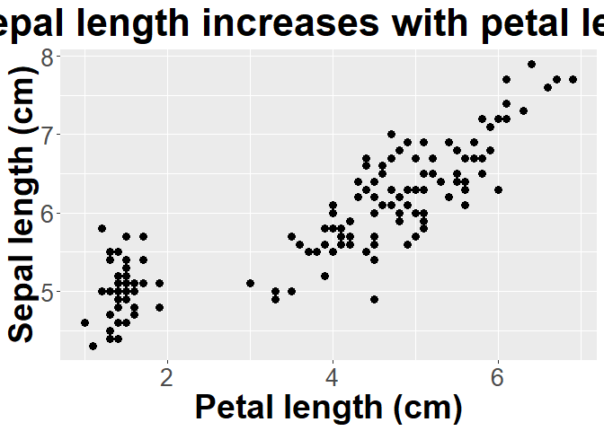
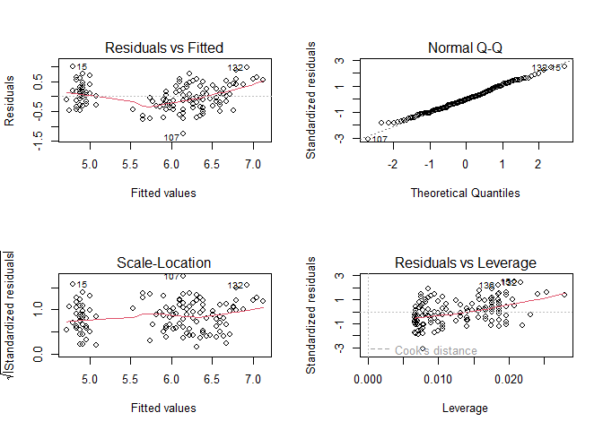

Before doing this, review the **9. Linear Regression and Correlation** lecture set slides from 
https://sites.google.com/view/biostats/lessons/linear-regression-and-correlation and
the  **9_Regression_and_correlation.R** script in the lecture files folder of the
[CUNY-BioStats github repository](https://github.com/jsgosnell/CUNY-BioStats). 
Make sure you are comfortable with null and alternative hypotheses and appropriate plots
for all examples. Also make sure you understand the difference between
correlation and regression.


Remember you should

* add code chunks by clicking the *Insert Chunk* button on the toolbar or by
pressing *Ctrl+Alt+I* to answer the questions!
* **knit** your file to produce a markdown version that you can see!
* save your work often 
  * **commit** it via git!
  * **push** updates to github
  
  
## Example

Following the iris dataset from class


```r
library(ggplot2)
ggplot(iris, aes(x=Petal.Length, y=Sepal.Length)) +
  geom_point(size = 3) +
  ylab("Sepal Length")+ggtitle("Sepal length increases with petal length")+
  theme(axis.title.x = element_text(face="bold", size=28), 
        axis.title.y = element_text(face="bold", size=28), 
        axis.text.y  = element_text(size=20),
        axis.text.x  = element_text(size=20), 
        legend.text =element_text(size=20),
        legend.title = element_text(size=20, face="bold"),
        plot.title = element_text(hjust = 0.5, face="bold", size=32))+
  xlab("Petal length (cm)") +
  ylab("Sepal length (cm)")
```

<!-- -->

```r
iris_regression <- lm(Sepal.Length ~ Petal.Length, iris)
par(mfrow = c(2,2))
plot(iris_regression)
```

<!-- -->

```r
library(car)
```

```
## Loading required package: carData
```

```r
Anova(iris_regression, type = "III")
```

```
## Anova Table (Type III tests)
## 
## Response: Sepal.Length
##              Sum Sq  Df F value    Pr(>F)    
## (Intercept)  500.16   1 3018.28 < 2.2e-16 ***
## Petal.Length  77.64   1  468.55 < 2.2e-16 ***
## Residuals     24.53 148                      
## ---
## Signif. codes:  0 '***' 0.001 '**' 0.01 '*' 0.05 '.' 0.1 ' ' 1
```

```r
summary(iris_regression)
```

```
## 
## Call:
## lm(formula = Sepal.Length ~ Petal.Length, data = iris)
## 
## Residuals:
##      Min       1Q   Median       3Q      Max 
## -1.24675 -0.29657 -0.01515  0.27676  1.00269 
## 
## Coefficients:
##              Estimate Std. Error t value Pr(>|t|)    
## (Intercept)   4.30660    0.07839   54.94   <2e-16 ***
## Petal.Length  0.40892    0.01889   21.65   <2e-16 ***
## ---
## Signif. codes:  0 '***' 0.001 '**' 0.01 '*' 0.05 '.' 0.1 ' ' 1
## 
## Residual standard error: 0.4071 on 148 degrees of freedom
## Multiple R-squared:   0.76,	Adjusted R-squared:  0.7583 
## F-statistic: 468.6 on 1 and 148 DF,  p-value: < 2.2e-16
```


```r
cor.test(~ Sepal.Length + Petal.Length, data = iris)
```

```
## 
## 	Pearson's product-moment correlation
## 
## data:  Sepal.Length and Petal.Length
## t = 21.646, df = 148, p-value < 2.2e-16
## alternative hypothesis: true correlation is not equal to 0
## 95 percent confidence interval:
##  0.8270363 0.9055080
## sample estimates:
##       cor 
## 0.8717538
```

```r
cor.test(~ Sepal.Length + Petal.Length, data = iris,
         method="spearman")
```

```
## Warning in cor.test.default(x = mf[[1L]], y = mf[[2L]], ...): Cannot compute
## exact p-value with ties
```

```
## 
## 	Spearman's rank correlation rho
## 
## data:  Sepal.Length and Petal.Length
## S = 66429, p-value < 2.2e-16
## alternative hypothesis: true rho is not equal to 0
## sample estimates:
##       rho 
## 0.8818981
```


## Practice

### 1
  

1.  A professor carried out a long-term study to see how various factors impacted
pulse rate before and after exercise.  Data can be found at 

http://www.statsci.org/data/oz/ms212.txt

With more info at 

http://www.statsci.org/data/oz/ms212.html.

Is there evidence that age, height, or weight impact change in pulse rate for students who ran (Ran column = 1)?  For each of these, how much variation in pulse rate do they explain?

### 2 

2. (from OZDASL repository, http://www.statsci.org/data/general/stature.html; reference for more information)

When anthropologists analyze human skeletal remains, an important piece of
information is living stature. Since skeletons are commonly based on
statistical methods that utilize measurements on small bones. The following
data was presented in a paper in the American Journal of Physical
Anthropology to validate one such method.
Data is available @

http://www.statsci.org/data/general/stature.txt

as a tab-delimted file (need to use read.table!)
Is there evidence that metacarpal bone length is a good predictor of
stature? If so, how much variation does it account for in the response
variable?

### 3

3. Data on medals won by various countries in the 1992 and 1994 Olympics is
available in a tab-delimited file at 

http://www.statsci.org/data/oz/medals.txt

More information on the data can be found at: 

http://www.statsci.org/data/oz/medals.html

Is there any relationship between a country’s population and the total
number of medals they win?

### 4
 
4. Continuing with the Olympic data, is there a relationship between the
latitude of a country and the number of medals won in summer or winter
Olympics?

### 5

5. Data on FEV (forced expiratory volume), a measure of lung function, can
be found at 

http://www.statsci.org/data/general/fev.txt

More information on the dataset is available at 

http://www.statsci.org/data/general/fev.html.

Is there evidence that FEV depends on age or height? If so, how do these
factors impact FEV, and how much variance does each explain? 

### 6 

6. Continuing with the FEV data, produce plots that illustrate how height, age, and gender each impact FEV.  
